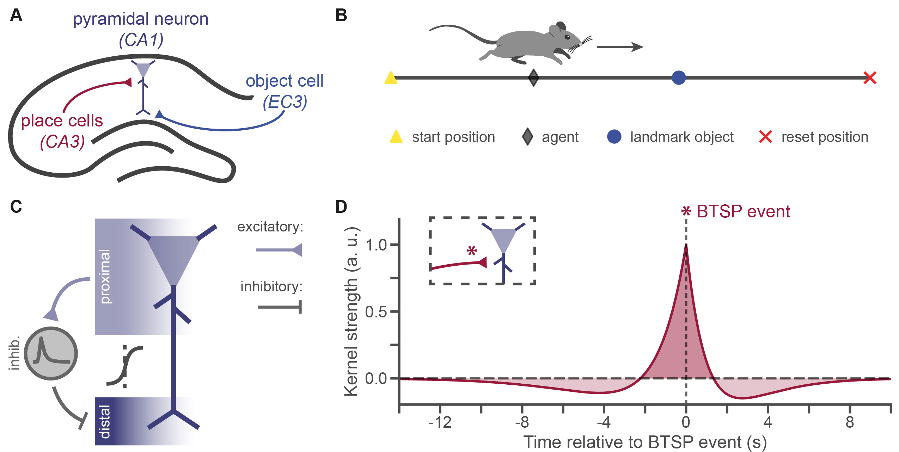
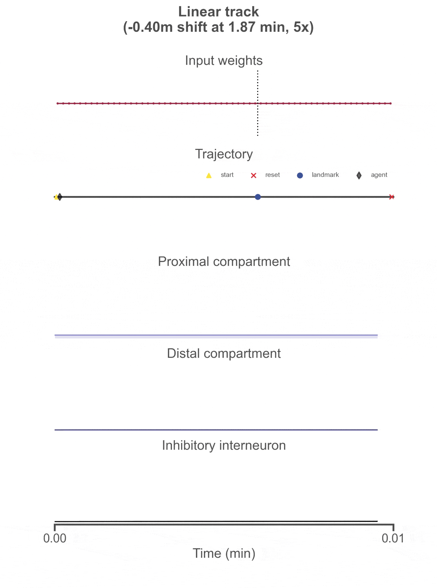

# Few-shot learning of predictive features with dendrites and behavioural timescale synaptic plasticity in the hippocampus

## 1. Description

This repository contains code to simulate few-shot learning of predictive features with dendrites and behavioural timescale synaptic plasticity (BTSP) in a hippocampal circuit.  



Neural activity is simulated in a circuit composed of place cells, object cells, pyramidal neurons and inhibitory interneurons (A) while an agent visits target landmark objects in a continuous linear track or open field environment (B). Pyramidal neurons are simulated with two nonlinearly connected compartments (proximal and distal) (C). The proximal compartment receives inputs from the place cells. Each distal compartment receives input from a target object cell, and delayed inhibition from its paired proximal compartment. 

Co-activation of both compartments can trigger plateau potentials in the pyramidal neuron. These in turn induce BTSP learning at the place cell inputs, resulting in the emergence and reshaping of place fields (D). After initial learning, if a pyramidal neuron's place field is sufficiently predictive of the target object that activates its distal compartment, it can anticipate and inhibit this activation, preventing future plateau potentials and additional BTSP learning. The dynamics of this circuit thus drive the pyramidal neurons to form self-stabilising place fields that are predictive of the objects or features of an environment. 




The simulations were developed using the [`RatInABox`](https://github.com/RatInABox-Lab/RatInABox) package.

For more information, see our preprint: [Gillon & Clopath, 2026](https://www.biorxiv.org/content/10.64898/2026.05.08.723802). 

## 2. Installation

This package can be installed, optionally in a virtual environment, using `pip install git+https://github.com/colleenjg/predhpc` and imported with `import predhpc`.

This code has been tested with `Python 3.11`. For package dependencies, see `requirements.txt`.

## 3. Scripts and modules

- **`predhpc/`**:
    - `env`: Custom `RatInABox` environments (e.g., `LinearResetEnv`, `TEnv`, `OpenField`).
    - `agent`: Custom `RatInABox` agents (e.g., `ResetableAgent`, `LinearResetAgent`, `TAgent`, `OpenFieldAgent`).
    - **`neurons/`**: Custom `RatInABox` neuron layers (e.g., `ObjectCells`, `BTSPLayer`, `NMDALayer`, `TwoCompLayer`).
    - **`experiments/`**: Linear track analyses and metrics.
    - **`util/`**: Custom utilities.
    - `run_manager`: Tools for running simulations in various environments.
- **`scripts/`**: Examples of simulations and analyses.
- **`results/`**: Results from script, paper and experiment analyses.

## 4. Paper

The code for running the analyses reported in the paper, and for reproducing the figures can be found under `predhpc/paper` and `predhpc/paper_plot_fcts`.   
Paper figures are also reproduced in `predhpc/scripts/paper.ipynb`.  

## 5. Author

Code written by Colleen Gillon (c _dot_ gillon _at_ imperial _dot_ ac _dot_ uk).

Please do not hesitate to contact me or open an issue/pull request, if you have trouble using the codebase or have improvements to propose.  

## 6. Citation

```
@Article{Gillon2026,
  title={Few-shot learning of predictive features with dendrites and behavioural timescale synaptic plasticity in the hippocampus},
  author={Gillon, Colleen J. and Clopath, Claudia},
  journal={{bioRxiv}},
  year = {2026},
  date = {2026-05},
  publisher = {Cold Spring Harbor Laboratory},
  pages = {1-49},
  doi = {10.64898/2026.05.08.723802},  
  url = {https://www.biorxiv.org/content/10.64898/2026.05.08.723802},
}
```